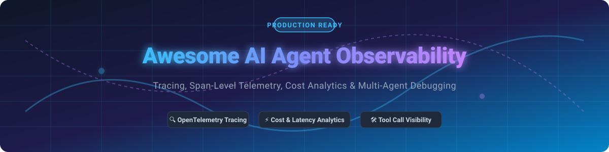

# 🤖 Awesome AI Agent Observability 🚀

  
  
  
  
  
  

  

## 🌟 Top AI Agent Observability & Telemetry Ecosystem

**Curated List of SaaS Products & Open-Source GitHub Projects for AI Agent Observability, Tracing, and Evaluation**  

*Focused on Agent Tracing, OpenTelemetry (OTel) Span-Level Telemetry, Session Replay, Cost & Latency Analytics, Tool-Call Visibility, Prompt Management, and Production AI Debugging.*  

---

## 📌 Table of Contents

- [💡 Market Overview & Sector Dynamics](#-market-overview--sector-dynamics)
- [🏢 SaaS & Hosted Platforms](#-saas--hosted-platforms)
- [🔓 Open-Source GitHub Projects](#-open-source-github-projects)
- [🤝 How to Contribute](#-how-to-contribute)
- [💖 Support & Sponsorship](#-support--sponsorship)
- [📈 Star History](#-star-history)
- [⚠️ Disclaimer](#%EF%B8%8F-disclaimer)

---

## 💡 Market Overview & Sector Dynamics

> **Market Size Estimate**: The AI Observability, LLM Evaluation, and Agent Telemetry market is estimated at **$1.8B – $2.5B** in 2026, driven by enterprise adoption of autonomous multi-agent workflows, autonomous coding agents, and complex RAG systems.
>
> **Market Structure**: The sector is **moderately fragmented**, transitioning from point solutions to platform consolidation. Heavy M&A activity (e.g., CoreWeave acquiring W&B for ~$1.7B, Dynatrace acquiring Arize, ServiceNow acquiring Traceloop) indicates major infrastructure players are absorbing specialized LLM telemetry tooling.

---

## 🏢 SaaS & Hosted Platforms

The table below lists leading commercial SaaS platforms for LLM tracing and multi-agent monitoring, **sorted by Company Size / Valuation (Descending)**:

| Platform 🏢 | Company Size / Valuation 💰 | Starting Paid Pricing 💲 | Free Tier Limits 🎁 | Description 📝 |
| :--- | :--- | :--- | :--- | :--- |
| **[Weights & Biases Weave](https://wandb.ai/weave)** | **~$1.7B Valuation** *(Acquired by CoreWeave)* | Starts at ~$60/mo (Pro Plan) | Free for personal/academic use (100 hours/mo, basic tracing) | MLOps & LLM observability platform integrating experiment tracking with agent trace logging. |
| **[Arize AX / Phoenix](https://arize.com/)** | **~$915M Valuation** *(Acquired by Dynatrace)* | Starts at $50/mo (AX Pro) | AX Free: 25,000 spans/mo with 15-day data retention | Enterprise LLM & agent observability platform providing tracing, evaluations, and root-cause analysis. |
| **[Braintrust](https://www.braintrust.dev/)** | **~$800M Valuation** *(Series B)* | Starts at $249/mo (Pro Plan) | Starter Plan: $10/mo included credits (~1 GB processed data & 10,000 scores, 14-day retention) | Enterprise AI evaluation, prompt engineering, and agent trajectory tracing platform. |
| **[LangSmith](https://www.langchain.com/langsmith)** | **~$200M+ Valuation** *(LangChain Inc.)* | Starts at $39/seat/mo | Developer Plan: 1 seat, 5,000 base traces/mo, 14-day data retention | Observability, debugging, and evaluation hub tailored for LangChain & LangGraph agents. |
| **[Traceloop](https://www.traceloop.com/)** | **Acquired by ServiceNow** | Enterprise marketplace pricing | Free Plan: 50,000 spans/mo, unlimited seats, 24-hour data retention | OpenTelemetry-native GenAI tracing and prompt monitoring platform. |
| **[Helicone](https://github.com/Helicone/helicone)** | **Acquired by Mintlify** | Starts at $79/mo (Pro Plan) | Hobby Plan: 10,000 requests/mo, 1 GB storage, 7-day data retention | High-speed proxy-based logging and cost analytics gateway for LLM agent traffic. |
| **[Langfuse (Cloud)](https://langfuse.com/)** | **Series A / Venture-Backed** | Starts at $59/mo (Team Plan) | Hobby Plan: 50,000 units/mo, max 2 users, 30-day data retention | Developer-first LLM engineering platform for multi-step agent tracing, prompt management, and evals. |
| **[Lunary](https://lunary.ai/)** | **Seed / Early Stage** | Starts at $49/mo (Pro Plan) | Developer Plan: 10,000 events/mo, 1 user, 14-day data retention | Production observability and analytics for LLM and agent session replays. |

---

## 🔓 Open-Source GitHub Projects

Below are top open-source projects for self-hosted agent tracing, OpenTelemetry (OTel) collectors, and evaluation frameworks, **sorted by Stars_Count (Descending)**:

| Repository 📦 | GitHub_Stars ⭐ | License 📄 | Focus Area 🎯 |
| :--- | :--- | :--- | :--- |
| **[BerriAI/litellm](https://github.com/BerriAI/litellm)** |  | MIT | Proxy gateway for 100+ LLMs with unified logging, budget tracking, and tracing output. |
| **[langfuse/langfuse](https://github.com/langfuse/langfuse)** |  | MIT | Complete open-source LLM & agent engineering platform—traces, spans, sessions, prompt management, and evaluations. |
| **[comet-ml/opik](https://github.com/comet-ml/opik)** |  | Apache-2.0 | Open evaluation and tracing framework for LLM applications and complex agent workflows. |
| **[Arize-ai/phoenix](https://github.com/Arize-ai/phoenix)** |  | ELv2 / Open | Open-source AI observability, tracing, and evaluation library designed for notebooks and self-hosted clusters. |
| **[Helicone/helicone](https://github.com/Helicone/helicone)** |  | Apache-2.0 | Lightweight LLM monitoring proxy capturing traces, latency metrics, and API costs without heavy SDK integration. |
| **[agentops-ai/agentops](https://github.com/agentops-ai/agentops)** |  | MIT | Python SDK & platform specifically for agent trajectory testing, agent session replay, and failure analysis. |
| **[traceloop/openllmetry](https://github.com/traceloop/openllmetry)** |  | Apache-2.0 | OpenTelemetry-based standard instrumentation for GenAI, agent frameworks, LLMs, and vector databases. |
| **[openlit/openlit](https://github.com/openlit/openlit)** |  | Apache-2.0 | Vendor-neutral OpenTelemetry auto-instrumentation for AI stack observability (Grafana, Datadog, Jaeger integration). |
| **[lunary-ai/lunary](https://github.com/lunary-ai/lunary)** |  | MIT | Open-source platform for agent tracing, user session tracking, prompt template testing, and analytics. |

---

### 🧩 Additional Architecture Options

- **Full Observability Stack**: Self-hosted **Langfuse** or **Opik** for end-to-end agent tracing, dataset management, and automated evals.
- **OpenTelemetry Standard**: **OpenLLMetry** or **OpenLIT** paired with existing enterprise backends (Grafana, Jaeger, Datadog, Prometheus).
- **Zero-Code Proxy Layer**: **Helicone** or **LiteLLM** for quick request logging, rate limiting, and cost tracking.
- **Agent Framework Compatibility**: Native integrations available for **LangGraph**, **CrewAI**, **AutoGen**, **LlamaIndex**, and **DSPy**.

---

## 🤝 How to Contribute

We welcome community contributions! Follow these steps to submit new SaaS platforms or open-source tools:

1. 🍴 **Fork** this repository.
2. 📝 Edit `README.md` following the tabular format established above.
3. 🔍 Ensure all details (pricing, free tier limits, Stars_Badges, and links) are verified.
4. 🚀 Submit a **Pull Request** with a descriptive summary of your addition.

---

## 💖 Support & Sponsorship

Thank you for exploring this curated list! If you found this repository helpful, please consider:
- ⭐ **Starring** the repository to boost visibility.
- 🍴 **Forking** it to share with your network or add your own contributions.
- 📣 **Sharing** it with fellow AI developers and platform engineers.
- ☕ Supporting further open-source development by buying a coffee via the [GitHub Sponsor Dashboard](https://github.com/sponsors/ishandutta2007).

---

## 📈 Star History

---

## ⚠️ Disclaimer

- This repository is a **community-curated list** provided for educational and research purposes.
- Agent telemetry often captures raw prompt inputs, function signatures, and sensitive user data. Always configure data redaction, encryption at rest, and strict access controls in production.

---

  <b>Built for AI Engineers, Agent Architects, and Platform Teams. ⭐ Star this repository to stay updated!</b>

